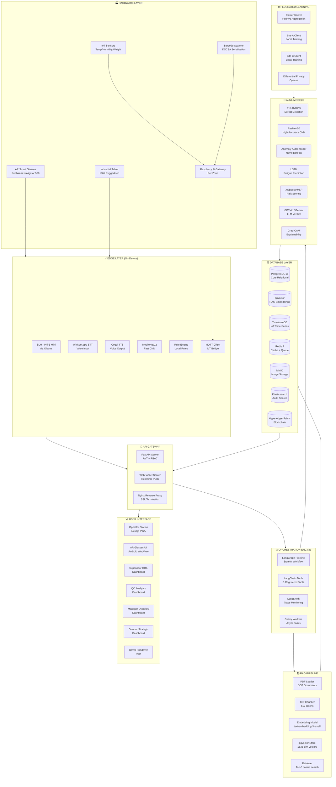
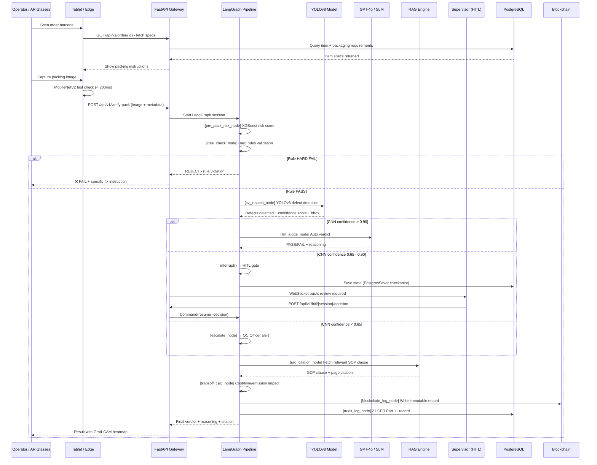
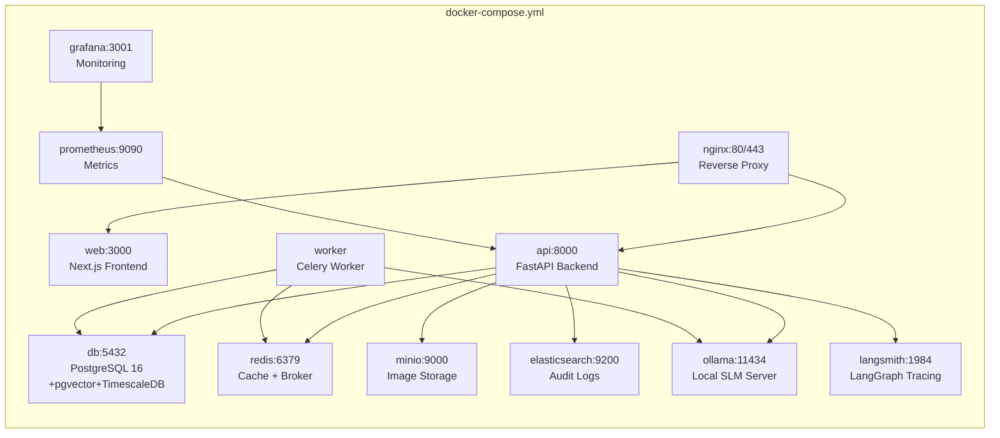

# 🏗️ PharmaPack QV — Full System Architecture & Project Structure
## Complete Build-Ready Specification

> **Date**: 2026-09-05 | **Status**: Finalised Architecture

---

## 📐 PART 1 — SYSTEM ARCHITECTURE OVERVIEW



---

## 🔄 PART 2 — PACKING VERIFICATION DATA FLOW



---

## 🗂️ PART 3 — COMPLETE PROJECT FOLDER STRUCTURE

```
pharmapack-qv/
│
├── 📄 README.md                          ← Project overview + setup
├── 📄 docker-compose.yml                 ← All services definition
├── 📄 docker-compose.dev.yml             ← Dev overrides
├── 📄 .env.example                       ← Environment variables template
├── 📄 Makefile                           ← Common commands (make run, make test)
├── 📄 pyproject.toml                     ← Python project config
│
├── 📁 backend/                           ← FastAPI Python backend
│   ├── 📄 main.py                        ← FastAPI app entry point
│   ├── 📄 config.py                      ← Settings (env vars via Pydantic)
│   ├── 📄 requirements.txt               ← All Python dependencies
│   │
│   ├── 📁 api/                           ← API routes (FastAPI routers)
│   │   ├── 📄 __init__.py
│   │   ├── 📄 routes_verify.py           ← POST /api/v1/verify-pack
│   │   ├── 📄 routes_orders.py           ← GET /api/v1/order/{id}
│   │   ├── 📄 routes_hitl.py             ← HITL decision endpoints
│   │   ├── 📄 routes_dashboard.py        ← Dashboard data endpoints
│   │   ├── 📄 routes_rag.py              ← RAG query endpoint
│   │   ├── 📄 routes_recall.py           ← Recall simulation endpoint
│   │   ├── 📄 routes_auth.py             ← Login / JWT endpoints
│   │   ├── 📄 routes_audit.py            ← Audit trail export
│   │   └── 📄 routes_wms.py              ← WMS connector endpoints
│   │
│   ├── 📁 core/                          ← Core business logic
│   │   ├── 📄 __init__.py
│   │   ├── 📄 auth.py                    ← JWT auth + RBAC middleware
│   │   ├── 📄 permissions.py             ← Role permission matrix (10 roles)
│   │   ├── 📄 exceptions.py              ← Custom exception classes
│   │   └── 📄 logging.py                 ← Structured logging (loguru)
│   │
│   ├── 📁 models/                        ← SQLAlchemy ORM models
│   │   ├── 📄 __init__.py
│   │   ├── 📄 operator.py                ← Operator model
│   │   ├── 📄 item.py                    ← Pharmaceutical item model
│   │   ├── 📄 packaging_spec.py          ← Packaging requirement model
│   │   ├── 📄 packing_session.py         ← Packing session + verdict
│   │   ├── 📄 damage_outcome.py          ← Post-dispatch damage record
│   │   ├── 📄 workload.py                ← Operator workload tracker
│   │   ├── 📄 audit_trail.py             ← 21 CFR Part 11 audit log
│   │   ├── 📄 sop_document.py            ← RAG document index
│   │   └── 📄 sop_chunk.py               ← pgvector chunk store
│   │
│   ├── 📁 schemas/                       ← Pydantic request/response schemas
│   │   ├── 📄 __init__.py
│   │   ├── 📄 verify_request.py          ← VerifyPackRequest schema
│   │   ├── 📄 verify_response.py         ← VerifyPackResponse schema
│   │   ├── 📄 hitl_schemas.py            ← HITL decision schemas
│   │   ├── 📄 dashboard_schemas.py       ← Dashboard data schemas
│   │   └── 📄 auth_schemas.py            ← Login / token schemas
│   │
│   ├── 📁 db/                            ← Database layer
│   │   ├── 📄 __init__.py
│   │   ├── 📄 session.py                 ← Async DB session factory
│   │   ├── 📄 init_db.py                 ← Table creation + seed data
│   │   └── 📁 migrations/               ← Alembic migration files
│   │       ├── 📄 env.py
│   │       ├── 📄 script.py.mako
│   │       └── 📁 versions/
│   │           ├── 📄 001_initial_schema.py
│   │           ├── 📄 002_add_pgvector.py
│   │           ├── 📄 003_add_timescale.py
│   │           └── 📄 004_blockchain_table.py
│   │
│   ├── 📁 pipeline/                      ← LangGraph verification pipeline
│   │   ├── 📄 __init__.py
│   │   ├── 📄 graph.py                   ← LangGraph StateGraph definition
│   │   ├── 📄 state.py                   ← PackingState TypedDict
│   │   ├── 📄 checkpointer.py            ← PostgresSaver setup
│   │   │
│   │   └── 📁 nodes/                    ← Individual graph nodes
│   │       ├── 📄 __init__.py
│   │       ├── 📄 pre_pack_risk.py       ← XGBoost risk scoring node
│   │       ├── 📄 rule_check.py          ← Rule engine node
│   │       ├── 📄 cv_inspect.py          ← YOLOv8 + MobileNetV2 node
│   │       ├── 📄 confidence_router.py   ← Confidence-based routing node
│   │       ├── 📄 hitl_gate.py           ← HITL interrupt() node
│   │       ├── 📄 llm_judge.py           ← LLM verdict synthesis node
│   │       ├── 📄 rag_citation.py        ← RAG SOP retrieval node
│   │       ├── 📄 tradeoff_calc.py       ← Cost/time/emission node
│   │       ├── 📄 blockchain_log.py      ← Hyperledger write node
│   │       ├── 📄 audit_log.py           ← DB audit record node
│   │       ├── 📄 notify.py              ← WebSocket push node
│   │       ├── 📄 reject.py              ← Hard reject node
│   │       ├── 📄 escalate.py            ← QC escalation node
│   │       └── 📄 auto_verdict.py        ← Auto pass/fail node
│   │
│   ├── 📁 tools/                         ← LangChain registered tools
│   │   ├── 📄 __init__.py
│   │   ├── 📄 packing_rule_checker.py    ← PackingRuleChecker tool
│   │   ├── 📄 image_inspection.py        ← ImageInspectionTool
│   │   ├── 📄 sop_retriever.py           ← SOPRetriever (RAG) tool
│   │   ├── 📄 workload_checker.py        ← WorkloadChecker tool
│   │   ├── 📄 emission_calculator.py     ← EmissionCalculator tool
│   │   └── 📄 audit_logger.py            ← AuditLogger tool
│   │
│   ├── 📁 ai/                            ← AI/ML model code
│   │   ├── 📄 __init__.py
│   │   │
│   │   ├── 📁 vision/                   ← Computer vision models
│   │   │   ├── 📄 __init__.py
│   │   │   ├── 📄 yolo_detector.py       ← YOLOv8 inference wrapper
│   │   │   ├── 📄 mobilenet_classifier.py← MobileNetV2 classifier
│   │   │   ├── 📄 resnet_classifier.py   ← ResNet-50 (server-side)
│   │   │   ├── 📄 gradcam.py             ← Grad-CAM heatmap generator
│   │   │   └── 📄 anomaly_detector.py    ← Autoencoder anomaly model
│   │   │
│   │   ├── 📁 tabular/                  ← Tabular ML models
│   │   │   ├── 📄 __init__.py
│   │   │   ├── 📄 risk_scorer.py         ← XGBoost + MLP pre-pack risk
│   │   │   └── 📄 fatigue_predictor.py   ← LSTM fatigue LSTM model
│   │   │
│   │   ├── 📁 llm/                      ← LLM integration
│   │   │   ├── 📄 __init__.py
│   │   │   ├── 📄 llm_client.py          ← Unified LLM client (GPT/Gemini/Anthropic)
│   │   │   ├── 📄 slm_client.py          ← Ollama SLM client (Phi-3/Mistral)
│   │   │   └── 📄 prompt_templates.py    ← All LLM prompt templates
│   │   │
│   │   └── 📁 rag/                      ← RAG pipeline
│   │       ├── 📄 __init__.py
│   │       ├── 📄 document_loader.py     ← PDF/SOP document ingestion
│   │       ├── 📄 chunker.py             ← Text chunking (512 tokens)
│   │       ├── 📄 embedder.py            ← Embedding model wrapper
│   │       ├── 📄 vector_store.py        ← pgvector store interface
│   │       ├── 📄 retriever.py           ← Top-K cosine similarity search
│   │       └── 📄 rag_chain.py           ← Full RAG chain with citation
│   │
│   ├── 📁 rules/                         ← Rule engine
│   │   ├── 📄 __init__.py
│   │   ├── 📄 engine.py                  ← Rule evaluation engine
│   │   ├── 📄 rule_loader.py             ← Load rules from JSON config
│   │   └── 📁 rule_definitions/         ← Rule JSON files
│   │       ├── 📄 temperature_zone_rules.json
│   │       ├── 📄 fragility_rules.json
│   │       ├── 📄 weight_rules.json
│   │       ├── 📄 seal_rules.json
│   │       └── 📄 label_rules.json
│   │
│   ├── 📁 services/                      ← Business service layer
│   │   ├── 📄 __init__.py
│   │   ├── 📄 verification_service.py    ← Orchestrates full verification
│   │   ├── 📄 hitl_service.py            ← HITL queue management + SLA
│   │   ├── 📄 dashboard_service.py       ← Analytics aggregation
│   │   ├── 📄 recall_service.py          ← Recall simulation engine
│   │   ├── 📄 carbon_service.py          ← Packaging right-sizing optimizer
│   │   ├── 📄 skill_assessment.py        ← Operator zone skill analysis
│   │   ├── 📄 workload_service.py        ← Workload cap enforcement
│   │   ├── 📄 notification_service.py    ← WebSocket notification manager
│   │   └── 📄 capa_service.py            ← CAPA auto-generation (LLM)
│   │
│   ├── 📁 integrations/                  ← External system connectors
│   │   ├── 📄 __init__.py
│   │   ├── 📄 blockchain_client.py       ← Hyperledger Fabric SDK
│   │   ├── 📄 wms_sap.py                 ← SAP EWM connector stub
│   │   ├── 📄 wms_oracle.py              ← Oracle WMS connector stub
│   │   ├── 📄 wms_dynamics.py            ← MS Dynamics connector stub
│   │   └── 📄 wms_generic.py             ← Generic REST WMS connector
│   │
│   └── 📁 tasks/                         ← Celery async tasks
│       ├── 📄 __init__.py
│       ├── 📄 celery_app.py              ← Celery app + Redis config
│       ├── 📄 model_inference.py         ← Heavy CNN inference (async)
│       ├── 📄 report_generation.py       ← PDF report generation
│       ├── 📄 rag_indexing.py            ← SOP document indexing task
│       └── 📄 digital_twin_sync.py       ← IoT data aggregation task
│
├── 📁 ml/                                ← ML training code (separate from serving)
│   ├── 📄 README.md
│   │
│   ├── 📁 data/                          ← Dataset management
│   │   ├── 📄 download_datasets.py       ← Auto-download all datasets
│   │   ├── 📄 augment.py                 ← Albumentations pipeline
│   │   ├── 📄 validate_dataset.py        ← Great Expectations validation
│   │   ├── 📄 create_splits.py           ← 70/15/15 stratified split
│   │   └── 📁 raw/                      ← Downloaded raw datasets
│   │       ├── 📁 mvtec/
│   │       ├── 📁 kaputt/
│   │       ├── 📁 roboflow/
│   │       └── 📁 synthetic/
│   │
│   ├── 📁 training/                      ← Model training scripts
│   │   ├── 📄 train_yolov8.py            ← YOLOv8 fine-tuning
│   │   ├── 📄 train_mobilenet.py         ← MobileNetV2 classifier
│   │   ├── 📄 train_autoencoder.py       ← Anomaly autoencoder
│   │   ├── 📄 train_lstm.py              ← Fatigue LSTM model
│   │   └── 📄 train_risk_scorer.py       ← XGBoost + MLP risk model
│   │
│   ├── 📁 evaluation/                    ← Model evaluation
│   │   ├── 📄 evaluate_cnn.py            ← F1, precision, recall, AUC-ROC
│   │   ├── 📄 confusion_matrix.py        ← Confusion matrix + visualisation
│   │   ├── 📄 edge_case_tests.py         ← 5 edge case test suite
│   │   └── 📄 baseline_comparison.py     ← Before vs after metrics
│   │
│   ├── 📁 federated/                     ← Federated learning
│   │   ├── 📄 server.py                  ← Flower FedAvg server
│   │   ├── 📄 client.py                  ← Flower client (per site)
│   │   ├── 📄 simulate_sites.py          ← Simulate 3 warehouse sites
│   │   └── 📄 privacy.py                 ← Opacus differential privacy
│   │
│   ├── 📁 models_store/                  ← Trained model artifacts
│   │   ├── 📁 yolov8/
│   │   │   ├── 📄 best.pt                ← PyTorch weights
│   │   │   └── 📄 best.onnx              ← ONNX export for serving
│   │   ├── 📁 mobilenet/
│   │   ├── 📁 autoencoder/
│   │   ├── 📁 lstm_fatigue/
│   │   └── 📁 risk_scorer/
│   │
│   └── 📁 experiments/                   ← MLflow experiment tracking
│       └── 📄 mlruns/                   ← Auto-generated by MLflow
│
├── 📁 rag_knowledge_base/                ← RAG document library
│   ├── 📄 README.md
│   ├── 📁 regulatory/                   ← Regulatory PDFs
│   │   ├── 📄 EU_GDP_Guidelines_2013.pdf
│   │   ├── 📄 WHO_TRS_1025_GDP.pdf
│   │   ├── 📄 FDA_21_CFR_Part_211.pdf
│   │   ├── 📄 EU_GMP_Annex_15.pdf
│   │   └── 📄 DSCSA_Guidance.pdf
│   ├── 📁 internal_sops/               ← Company-specific SOPs (uploaded)
│   │   ├── 📄 SOP-CZ-001_cold_zone_packing.pdf
│   │   ├── 📄 SOP-AM-001_ambient_packing.pdf
│   │   └── 📄 SOP-QC-001_inspection_procedure.pdf
│   └── 📁 packaging_specs/             ← Product-specific packaging specs
│       └── 📄 packaging_matrix.pdf
│
├── 📁 frontend/                          ← Next.js 14 web application
│   ├── 📄 package.json
│   ├── 📄 next.config.js
│   ├── 📄 tailwind.config.js
│   ├── 📄 tsconfig.json
│   │
│   ├── 📁 app/                          ← Next.js App Router
│   │   ├── 📄 layout.tsx                ← Root layout + providers
│   │   ├── 📄 page.tsx                  ← Landing / role-select
│   │   │
│   │   ├── 📁 (auth)/                  ← Auth routes
│   │   │   └── 📁 login/
│   │   │       └── 📄 page.tsx          ← Login screen
│   │   │
│   │   ├── 📁 operator/                ← L1 Operator views
│   │   │   ├── 📁 pack/
│   │   │   │   └── 📄 page.tsx          ← 📦 PACKING STATION SCREEN
│   │   │   └── 📁 voice/
│   │   │       └── 📄 page.tsx          ← 🎤 VOICE ASSISTANT SCREEN
│   │   │
│   │   ├── 📁 supervisor/              ← L2 Supervisor views
│   │   │   ├── 📁 dashboard/
│   │   │   │   └── 📄 page.tsx          ← 🖥️ REAL-TIME ZONE DASHBOARD
│   │   │   └── 📁 hitl/
│   │   │       ├── 📄 page.tsx          ← 👁️ HITL REVIEW QUEUE
│   │   │       └── 📁 [sessionId]/
│   │   │           └── 📄 page.tsx      ← 🔍 INDIVIDUAL REVIEW SCREEN
│   │   │
│   │   ├── 📁 qc/                      ← L3 QC Officer views
│   │   │   ├── 📁 analytics/
│   │   │   │   └── 📄 page.tsx          ← 📊 ERROR PATTERN ANALYTICS
│   │   │   ├── 📁 capa/
│   │   │   │   └── 📄 page.tsx          ← 📋 CAPA MANAGEMENT
│   │   │   └── 📁 edge-cases/
│   │   │       └── 📄 page.tsx          ← 🧪 EDGE CASE REVIEW
│   │   │
│   │   ├── 📁 qa/                      ← L3 QA Executive views
│   │   │   ├── 📁 sop/
│   │   │   │   └── 📄 page.tsx          ← 📄 SOP QUERY (RAG)
│   │   │   └── 📁 audit/
│   │   │       └── 📄 page.tsx          ← 🏛️ AUDIT TRAIL VIEWER
│   │   │
│   │   ├── 📁 responsible-person/      ← L3 RP views
│   │   │   ├── 📁 compliance/
│   │   │   │   └── 📄 page.tsx          ← ✅ GDP COMPLIANCE SCREEN
│   │   │   └── 📁 sign-off/
│   │   │       └── 📄 page.tsx          ← ✍️ BATCH SIGN-OFF
│   │   │
│   │   ├── 📁 manager/                 ← L4 Warehouse Manager views
│   │   │   ├── 📁 overview/
│   │   │   │   └── 📄 page.tsx          ← 📈 ZONE KPI OVERVIEW
│   │   │   ├── 📁 tradeoff/
│   │   │   │   └── 📄 page.tsx          ← ⚖️ 4-WAY TRADEOFF DASHBOARD
│   │   │   └── 📁 recall/
│   │   │       └── 📄 page.tsx          ← 🔄 RECALL SIMULATION
│   │   │
│   │   ├── 📁 director/                ← L5 Director views
│   │   │   └── 📁 strategic/
│   │   │       └── 📄 page.tsx          ← 🎯 STRATEGIC DASHBOARD
│   │   │
│   │   └── 📁 driver/                  ← L0 Driver views
│   │       └── 📁 handover/
│   │           └── 📄 page.tsx          ← 🚗 DISPATCH HANDOVER
│   │
│   ├── 📁 components/                  ← Reusable React components
│   │   ├── 📁 ui/                      ← shadcn/ui base components
│   │   │   ├── 📄 button.tsx
│   │   │   ├── 📄 card.tsx
│   │   │   ├── 📄 badge.tsx
│   │   │   ├── 📄 dialog.tsx
│   │   │   └── 📄 ...
│   │   │
│   │   ├── 📁 verification/            ← Packing verification components
│   │   │   ├── 📄 ImageCapture.tsx     ← Camera capture + upload
│   │   │   ├── 📄 VerdictCard.tsx      ← Pass/Fail verdict display
│   │   │   ├── 📄 GradCAMOverlay.tsx   ← Heatmap overlay on image
│   │   │   ├── 📄 ConfidenceBar.tsx    ← CNN confidence score bar
│   │   │   └── 📄 DefectList.tsx       ← Detected defect list
│   │   │
│   │   ├── 📁 hitl/                    ← HITL review components
│   │   │   ├── 📄 HITLQueue.tsx        ← Review queue with SLA timers
│   │   │   ├── 📄 ReviewCard.tsx       ← Individual item review card
│   │   │   ├── 📄 DecisionPanel.tsx    ← Approve/Reject/Override buttons
│   │   │   └── 📄 SLATimer.tsx         ← Countdown timer (15 min SLA)
│   │   │
│   │   ├── 📁 dashboard/              ← Dashboard components
│   │   │   ├── 📄 TradeoffRadar.tsx    ← 4-way radar chart (Recharts)
│   │   │   ├── 📄 ZoneHeatmap.tsx      ← Live zone quality heatmap
│   │   │   ├── 📄 MetricCard.tsx       ← KPI metric card
│   │   │   ├── 📄 ErrorTrendChart.tsx  ← Error rate over time
│   │   │   └── 📄 EmissionTracker.tsx  ← CO₂ savings chart
│   │   │
│   │   ├── 📁 voice/                  ← Voice assistant components
│   │   │   ├── 📄 VoiceButton.tsx      ← Push-to-talk button
│   │   │   ├── 📄 Transcript.tsx       ← Conversation history display
│   │   │   └── 📄 SpeechVisualizer.tsx ← Audio waveform animation
│   │   │
│   │   └── 📁 layout/                 ← Layout components
│   │       ├── 📄 RoleNav.tsx          ← Role-specific navigation
│   │       ├── 📄 NotificationBell.tsx ← Real-time WebSocket alerts
│   │       └── 📄 AuditBreadcrumb.tsx  ← Session audit trail breadcrumb
│   │
│   └── 📁 lib/                        ← Frontend utilities
│       ├── 📄 api.ts                   ← API client (fetch wrapper)
│       ├── 📄 websocket.ts             ← WebSocket connection manager
│       ├── 📄 auth.ts                  ← Auth token management
│       └── 📄 utils.ts                 ← Helper functions
│
├── 📁 iot/                               ← IoT / edge gateway code
│   ├── 📄 README.md
│   ├── 📄 gateway.py                     ← Raspberry Pi MQTT gateway
│   ├── 📄 sensors.py                     ← Sensor reading abstraction
│   ├── 📄 digital_twin_publisher.py      ← Push readings to Digital Twin
│   └── 📄 requirements.txt              ← RPi Python deps
│
├── 📁 blockchain/                        ← Hyperledger Fabric setup
│   ├── 📄 README.md
│   ├── 📁 chaincode/                    ← Smart contract (Go)
│   │   └── 📁 packing-audit/
│   │       └── 📄 packing_audit.go      ← Chaincode for audit records
│   └── 📁 network/                      ← Fabric network config
│       ├── 📄 configtx.yaml
│       ├── 📄 crypto-config.yaml
│       └── 📄 docker-compose-fabric.yml
│
├── 📁 tests/                             ← All tests
│   ├── 📄 conftest.py                    ← pytest fixtures
│   ├── 📁 unit/                         ← Unit tests
│   │   ├── 📄 test_rule_engine.py
│   │   ├── 📄 test_risk_scorer.py
│   │   ├── 📄 test_rag_chain.py
│   │   ├── 📄 test_auth.py
│   │   └── 📄 test_workload_service.py
│   ├── 📁 integration/                  ← Integration tests
│   │   ├── 📄 test_verify_endpoint.py
│   │   ├── 📄 test_hitl_workflow.py
│   │   └── 📄 test_langgraph_pipeline.py
│   ├── 📁 edge_cases/                   ← 5 edge case tests
│   │   ├── 📄 test_low_light.py
│   │   ├── 📄 test_novel_defect.py
│   │   ├── 📄 test_operator_fatigue.py
│   │   ├── 📄 test_rag_failure.py
│   │   └── 📄 test_conflict_verdict.py
│   └── 📁 e2e/                          ← Playwright E2E tests
│       ├── 📄 test_operator_flow.spec.ts
│       └── 📄 test_supervisor_hitl.spec.ts
│
├── 📁 docs/                              ← Documentation
│   ├── 📄 requirements_specification.md  ← Formal requirements doc
│   ├── 📄 api_reference.md               ← Auto-generated from OpenAPI
│   ├── 📄 limitations_report.md          ← What the system can't do
│   ├── 📄 experiment_results.md          ← Baseline vs target vs measured
│   └── 📁 adr/                          ← Architecture Decision Records
│       ├── 📄 ADR-001-langgraph-hitl.md
│       ├── 📄 ADR-002-pgvector-rag.md
│       └── 📄 ADR-003-federated-learning.md
│
├── 📁 scripts/                           ← Utility scripts
│   ├── 📄 seed_database.py               ← Populate DB with test data
│   ├── 📄 index_sop_documents.py         ← Index PDFs into RAG
│   ├── 📄 generate_synthetic_images.py   ← AI image generation script
│   ├── 📄 run_experiment.py              ← Baseline vs treatment experiment
│   └── 📄 export_audit_report.py         ← GDP-compliant audit export
│
└── 📁 monitoring/                        ← Monitoring configuration
    ├── 📄 prometheus.yml                 ← Prometheus scrape config
    ├── 📁 grafana/
    │   └── 📁 dashboards/
    │       ├── 📄 system_metrics.json    ← API latency, DB queries
    │       └── 📄 ml_metrics.json        ← Model performance dashboard
    └── 📄 alerts.yml                     ← Prometheus alerting rules
```

---

## 🔧 PART 4 — DOCKER COMPOSE SERVICE MAP



---

## 📊 PART 5 — LANGGRAPH STATE DEFINITION

```python
# backend/pipeline/state.py

from typing import TypedDict, Optional, List
from enum import Enum

class VerdictEnum(str, Enum):
    PASS = "PASS"
    FAIL = "FAIL"
    REVIEW = "REVIEW"
    ESCALATE = "ESCALATE"
    OVERRIDE_PASS = "OVERRIDE_PASS"
    OVERRIDE_FAIL = "OVERRIDE_FAIL"

class RiskLevel(str, Enum):
    LOW = "LOW"
    MEDIUM = "MEDIUM"
    HIGH = "HIGH"
    CRITICAL = "CRITICAL"

class PackingState(TypedDict):
    # Session identity
    session_id: str
    order_id: str
    operator_id: str           # anonymised UUID
    zone_id: str
    item_id: str

    # Input data
    image_path: str            # MinIO path to uploaded image
    image_b64: Optional[str]   # Base64 for model inference

    # Risk scoring (pre-pack)
    risk_score: float          # 0.00 - 1.00
    risk_level: RiskLevel
    risk_factors: List[str]    # which factors drove the score

    # Rule engine results
    rule_passed: bool
    rule_violations: List[str] # e.g. ["SEAL_REQUIRED", "WEIGHT_EXCEEDED"]

    # CNN / vision results
    cnn_confidence: float      # 0.000 - 1.000
    cnn_defects: List[dict]    # [{class, confidence, bbox, severity}]
    gradcam_path: Optional[str]# Grad-CAM heatmap image path

    # HITL state
    hitl_required: bool
    hitl_reviewer_id: Optional[str]
    hitl_decision: Optional[str]
    hitl_notes: Optional[str]
    hitl_timestamp: Optional[str]

    # LLM verdict
    llm_verdict: Optional[VerdictEnum]
    llm_reasoning: Optional[str]
    llm_model_used: str        # which LLM was used

    # RAG citation
    rag_sop_clause: Optional[str]
    rag_source_doc: Optional[str]
    rag_page_number: Optional[int]

    # Trade-off metrics
    cost_impact_gbp: float
    time_added_seconds: int
    emission_g_co2: float
    reliability_score: float

    # Final
    final_verdict: Optional[VerdictEnum]
    blockchain_tx_id: Optional[str]
    audit_logged: bool
    notifications_sent: List[str]

    # Error handling
    error: Optional[str]
    retry_count: int
```

---

## 🖥️ PART 6 — ROLE-BASED UI SCREEN MAP

```
┌─── ROLE ───────────────┬─── SCREENS ──────────────────────────────────────────┐
│                        │                                                      │
│  L0 DRIVER             │  ✅ Dispatch Handover Gate                           │
│                        │     - Confirm packed items before loading            │
│                        │     - Working hours check (EU WTD)                   │
│                        │     - Route safety confirmation                      │
│                        │                                                      │
│  L1 PACKER             │  📦 Packing Station Screen                          │
│                        │     - Scan order → see packing instructions          │
│                        │     - Camera capture → submit image                  │
│                        │     - Real-time verdict (< 5 sec)                   │
│                        │     - Grad-CAM heatmap on failure                    │
│                        │     - Fix instruction if failed                      │
│                        │                                                      │
│                        │  🎤 Voice Assistant Screen                           │
│                        │     - Push-to-talk packing Q&A                      │
│                        │     - SOP lookup by voice                            │
│                        │     - Fatigue check dialogue                         │
│                        │                                                      │
│  L2 SUPERVISOR         │  🖥️ Real-Time Zone Dashboard                        │
│                        │     - Live zone quality heatmap                      │
│                        │     - Active session count per station               │
│                        │     - Alert feed (high-risk packs)                   │
│                        │                                                      │
│                        │  👁️ HITL Review Queue                               │
│                        │     - Pending reviews with SLA countdown             │
│                        │     - Image + Grad-CAM + CNN score                   │
│                        │     - [Approve] [Reject] [Override] [Escalate]      │
│                        │     - SLA breach auto-escalation                     │
│                        │                                                      │
│  L3 QC OFFICER         │  📊 Error Pattern Analytics                         │
│                        │     - Error rate by zone, shift, product class       │
│                        │     - Systematic error heatmap                       │
│                        │     - Damage outcome linkage chart                   │
│                        │                                                      │
│                        │  🧪 Edge Case Review Screen                          │
│                        │     - Low-confidence sessions review                 │
│                        │     - Novel defect flagging                          │
│                        │     - Model improvement suggestions                  │
│                        │                                                      │
│  L3 QA EXECUTIVE       │  📋 CAPA Management                                 │
│                        │     - LLM-generated CAPA reports                     │
│                        │     - SOP RAG query interface                        │
│                        │     - CAPA status tracker                            │
│                        │                                                      │
│  L3 RESPONSIBLE PERSON │  ✅ GDP Compliance Screen                           │
│                        │     - Electronic batch sign-off                      │
│                        │     - 21 CFR Part 11 audit export                    │
│                        │     - GDP clause violation alerts                    │
│                        │                                                      │
│  L4 WAREHOUSE MANAGER  │  📈 Zone KPI Overview                               │
│                        │     - Error rate, throughput, workload utilisation   │
│                        │     - Alert: zone abnormal patterns                  │
│                        │                                                      │
│                        │  ⚖️ 4-Way Trade-off Dashboard                       │
│                        │     - Cost / Time / Emissions / Reliability radar    │
│                        │     - Threshold slider → see impact live             │
│                        │                                                      │
│                        │  🔄 Recall Simulation Engine                         │
│                        │     - Input batch ID → full trace in < 5 sec        │
│                        │     - Units at risk, locations, GDP recall notice     │
│                        │                                                      │
│  L5 WAREHOUSE DIRECTOR │  🎯 Strategic Dashboard                              │
│                        │     - 30-day ROI: cost saved vs system cost          │
│                        │     - Error rate trend: before vs after              │
│                        │     - Board-ready PDF export                         │
│                        │     - CO₂ reduction monthly chart                    │
└────────────────────────┴──────────────────────────────────────────────────────┘
```

---

## 🌐 PART 7 — API ENDPOINTS (Complete)

```
METHOD  ENDPOINT                              ROLE ACCESS    DESCRIPTION
──────────────────────────────────────────────────────────────────────────────
POST    /api/v1/auth/login                    ALL            JWT login
POST    /api/v1/auth/refresh                  ALL            Refresh token

POST    /api/v1/verify-pack                   L1+            Submit image for verification
GET     /api/v1/session/{id}                  L2+            Get session detail + audit
GET     /api/v1/order/{id}                    L1+            Fetch order + packing spec

GET     /api/v1/hitl/queue                    L2+            Get HITL review queue
POST    /api/v1/hitl/{session}/decision       L2+            Submit HITL decision
GET     /api/v1/hitl/sla-status               L2+            SLA breach alerts

GET     /api/v1/dashboard/zone                L2+            Zone real-time KPIs
GET     /api/v1/dashboard/tradeoff            L4+            4-way tradeoff metrics
GET     /api/v1/dashboard/error-patterns      L3+            Error pattern analytics
GET     /api/v1/dashboard/strategic           L5             Director overview

POST    /api/v1/rag/query                     L3+            RAG SOP query + citation
POST    /api/v1/recall/simulate               L4+            Batch recall simulation
GET     /api/v1/audit/export                  L3-RP          GDP audit report export
POST    /api/v1/capa/generate                 L3-QA          Auto-generate CAPA report
POST    /api/v1/carbon/optimise               L4+            Packaging right-size calc

GET     /api/v1/workload/{operator}           L2+            Operator zone workload
GET     /api/v1/fatigue/{operator}            L2+            LSTM fatigue score

WebSocket /ws/supervisor-queue                L2+            HITL real-time notifications
WebSocket /ws/zone-alerts                     L2+            Zone status alerts
WebSocket /ws/digital-twin                    L4+            Digital twin live feed

POST    /api/v1/wms/sap/sync                  SYSTEM         SAP EWM data sync
POST    /api/v1/wms/oracle/sync               SYSTEM         Oracle WMS sync
GET     /api/v1/health                        PUBLIC         System health check
```

---

## 📏 PART 8 — MEASUREMENT FRAMEWORK (Experiment)

```
EXPERIMENT DESIGN:
  Duration:    4 weeks
  Sample:      Minimum 500 sessions per group
  Design:      A/B within-zone comparison
  Group A:     Control (current manual process)
  Group B:     Treatment (PharmaPack QV active)

METRICS TRACKED:
  Primary:
    error_escape_rate     = damage_outcomes.count / packing_sessions.count
    time_to_discovery     = damage_outcomes.reported_at - packing_sessions.submitted_at
    cost_per_error        = damage_outcomes.cost_gbp (average)

  Secondary:
    cnn_f1_score          = sklearn.metrics.f1_score(y_true, y_pred)
    cnn_auc_roc           = sklearn.metrics.roc_auc_score(y_true, y_prob)
    hitl_precision        = correct_overrides / total_overrides
    false_positive_rate   = good_packs_flagged / total_good_packs
    emission_reduction    = (return_shipments_avoided × 2.3kg_CO2_per_km)
    supervisor_hitl_time  = avg(hitl_decision_time) per shift
    risk_score_auc        = AUC of pre-pack risk score vs actual outcome
```

---

*PharmaPack QV — Full Architecture & Project Structure v1.0 | 2026-09-05*
*Build-ready specification | 137 technologies | 22 features | 10 roles*
